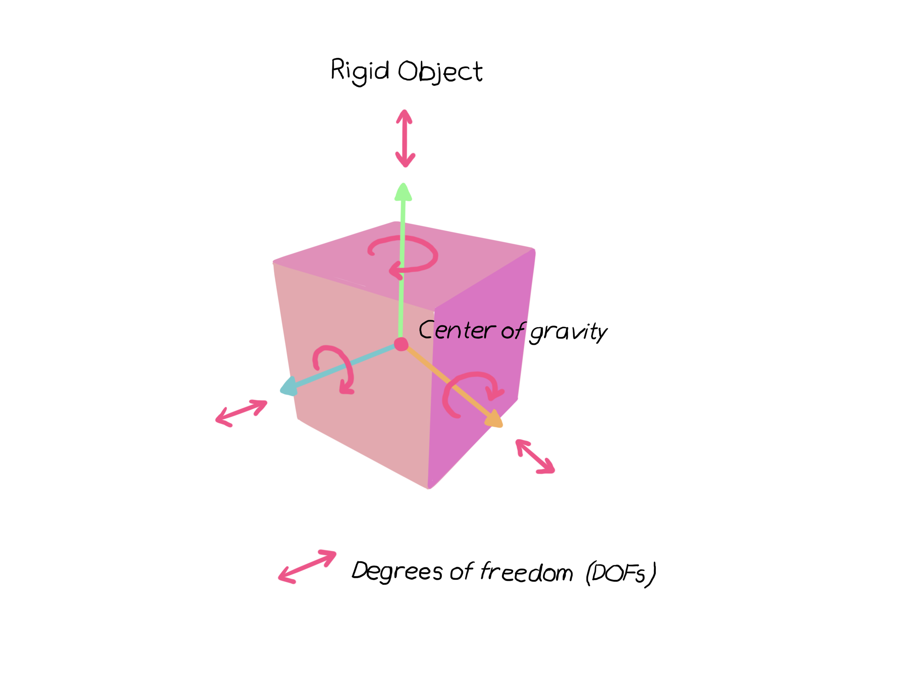

# SOFT ROBOTS

# SOFA
## Modelling

Modelling soft robots is a problematic task as many simulation softwares are unable to realistically mimic the properties of soft, flexible materials. For this project, a soft robotic limb is modeled in simulation before learning algorithms can be tested on it. To achieve realistic results it is important that the software used has certain properties; for example, the ability to accurately model soft materials and the ability to use it to test the machine learning models.

A software called SOFA (Simulation Open Framework Architecture) which is primarily used in simulation in medical fields has a soft robotics plugin which can be used to achieve the task at hand. Several tutorials can be found online on Youtube and some documentation is also included with the software when it is downloaded.



## First Steps

After downloading the SOFA software along with the soft robotics plugin I began by setting up some simple scenes that can be animated on SOFA. To begin we can start by experimenting with an object, such as a cuboid, and a floor. The object falls until it hits the floor. The object can be translated to the right or left, causing it to miss the floor; in this instance it will remain in free fall. Every scene starts with a root node, and other objects are added in relation to this. Gravity is also modelled in the code.


### Simple Scene

SOFA is able to animate .pyscn files. These are python files with an extra function named `createScene` that takes a root node as an input. The root node is the main parent node of the node tree. A scene consists of an ordered tree of nodes with parent/child relationships. Every node is built of components with names and features.



To set up this scene prefab objects are used. In this example the cube and floor prefabs are implemented and animated. The cube falls and stops upon collision with the floor. A contact distance is added as a buffer. Although this may seem appear unrealistic when the cube stops above the floor (i.e. before appearing to touch it), it is important to add this buffer to give the simulation enough time to compute the collision calculations.

```python

def createScene(rootNode):
    """This is my first scene"""
    MainHeader(rootNode, gravity=[0.0,-981.0,0.0])
    ContactHeader(rootNode, alarmDistance=15, contactDistance=10)

    Floor(rootNode,
          translation=[0.0,-160.0,0.0],
          isAStaticObject=True)

    Cube(rootNode,
          translation=[0.0,0.0,0.0],
          uniformScale=20.0)


    return rootNode

```

<video src="images/fallingCube.mov" width="320" height="200" controls preload></video><video src="images/fallingCubeWGravity.mov" width="320" height="200" controls preload></video>

Next, the cube prefab is replaced with an implimentation of a cube model from scratch.

### Object Models 

There are three types of models for simulation in SOFA,

1. Mechanical model
2. Visual model
3. Collision model

 


These models are able to correspond to work together and represent the properties of the object. 

The full code for this scene can be found on the [Defrost robotics github](https://github.com/SofaDefrost/SoftRobots/blob/master/docs/tutorials/FirstSteps/firststeps-tuto.pyscn).

```python

from stlib.scene import MainHeader, ContactHeader
from stlib.visuals import ShowGrid
from stlib.solver import DefaultSolver
from stlib.physics.rigid import Floor

def createScene(rootNode):
	ShowGrid(rootNode)

	MainHeader(rootNode, gravity=[0.0,-981.0,0.0])

   	#Collision built-in function 
	ContactHeader(rootNode, alarmDistance=10, contactDistance=5)

	cube = rootNode.createChild("Cube")

	### Mechanical model

	totalMass = 1.0
	volume = 1.0
	inertiaMatrix = [1.0, 0.0, 0.0, 0.0, 1.0, 0.0, 0.0, 0.0, 1.0]


	cube.createObject('MechanicalObject', 
			name="DOF", 
			template="Rigid3", 
			translation=[0.0,0.0,0.0], 
			rotation=[0.0,0.0,0.0])
			
	cube.createObject('UniformMass', 
			name="vertexMass", 
			vertexMass=[totalMass, 
			volume, 
			inertiaMatrix[:]])

	# Material behaviour when submitted to constraints
    
	cube.createObject('UncoupledConstraintCorrection')

	### Time integration and solver

	cube.createObject('EulerImplicitSolver', name='odesolver')
	cube.createObject('CGLinearSolver', name='Solver')


	### Visual Object of the Cube

	visual = cube.createChild("CubeVisual")
    
	# Graphic model based on a mesh
	visual.createObject('MeshObjLoader', 
			name="loader", 
			filename="mesh/smCube27.obj", 
			triangulate="true")
			
	visual.createObject('OglModel', 
			name="Visual", 
			src="@loader", 
			color=[0.1,0.0,1.0], 
			scale=20.0)
    
	# Building a correspondance between mechanical and visual representation
	visual.createObject('RigidMapping')

	### Collision Object for the Cube

	collision = cube.createChild("CubeCollisionModel")
	
	collision.createObject('MeshObjLoader', 
			name="loader", 
			filename="mesh/smCube27.obj", 
			triangulate="true", 
			scale=20.0)

	collision.createObject('MeshTopology', src="@loader")
	collision.createObject('MechanicalObject')

	collision.createObject('TTriangleModel')
	collision.createObject('TLineModel')
	collision.createObject('TPointModel')

	collision.createObject('RigidMapping')

	### Adding the Floor 
	floor = Floor(rootNode,
	  	name="Floor",
          	translation=[0.0,-300.0,0.0],
          	uniformScale=5.0,
          	isAStaticObject=True)

	return rootNode
    
```

### Manipulating Objects

An object can be moved in the scene by either modigying the translation vector feature in the code, or by using the SOFA gui. On the left hand panel, expand the menu for the object and double-click on the `MechanicalObject mstate` variable. Then go to the `Transofrmation` tab and modify the translation values. This will only apply to the current session and is does not affect the code.

### Modelling Deformable Objects

Due to the material properties of soft robots the simulation is only able to approxiamte the true behaviour of a deformable object. The most essential material properties to take into account are the stiffness and elasticity. The material modeled here will be silicone.

The behaviour of silicone is simulated using FEM along with a tetrahedral mesh provided with SOFA.

There are two important parameters to note which will be used in the code: Poisson's ratio and Young's modulus.

Poisson's ratio is a measure of the ratio of expansion perpendicular to contraction of a material.


Young's modulus indicates a material's ability to remain elastic under tension or compression.


## Soft Actuator

To model and simulate the behaviour of a soft actuator a volumetric mesh is used. This is computed using a surface mesh or image and the `CGALPlugin`.
The actuator mesh is loaded into SOFA and the force field can be turned on in the view panel to show the triangles making up the object.  The volumetric mesh is the .vtk file while a secondary surface mesh .stl file is used to model the surface. When the scene is animated using the code above the soft actuator will begin to free fall under gravity so it can be modified to have a fixed end on one side holding it in place. This is done by adding a `FixedBox`.

<video src="images/fixedBox.mov" width="320" height="200" controls preload></video>


```python
from stlib.physics.constraint import FixedBox

def Finger(parentNode=None, name="Finger",
           rotation=[0.0, 0.0, 0.0], translation=[0.0, 0.0, 0.0],
           fixingBox=[0.0,0.0,0.0], pullPointLocation=[0.0,0.0,0.0]):

    finger = Node(parentNode, name)
    eobject = ElasticMaterialObject(finger,
                               volumeMeshFileName="data/mesh/finger.vtk",
                               poissonRatio=0.3,
                               youngModulus=18000,
                               totalMass=0.5,
                               surfaceColor=[0.0, 0.8, 0.7],
                               surfaceMeshFileName="data/mesh/finger.stl",
                               rotation=rotation,
                               translation=translation)

    FixedBox(eobject, atPositions=[-10,-10,-10,10,10,15],
                      doVisualization=True)

    return finger
```

### Control

The finger will be actuated using cables that span from the base to the top of the finger. The cable is modeled using a template provided by the SoftRobot plugin called `PullingCable`. This is added to the finger function shown above.
A controller can be made using the PythonScriptController class and then added to the script.

```python
from softrobots.actuators import PullingCable
    ...
import Sofa

class FingerController(Sofa.PythonScriptController):
    def __init__(self, node, cable):
        self.cableconstraintvalue = cable.getObject("CableConstraint").findData('value')
        self.name = "FingerController"

    def onKeyPressed(self,c):
        if (c == "+"):
            self.cableconstraintvalue.value =  self.cableconstraintvalue.value[0][0] + 1.
        if (c == "-"):
            self.cableconstraintvalue.value =  self.cableconstraintvalue.value[0][0] - 1.
    
def Finger(parentNode=None, name="Finger",
           rotation=[0.0, 0.0, 0.0], translation=[0.0, 0.0, 0.0],
           fixingBox=[0.0,0.0,0.0], pullPointLocation=[0.0,0.0,0.0]):
           ...
           
    cable = PullingCable(eobject, cableGeometry=loadPointListFromFile("data/mesh/cable.json"))
    
    FingerController(eobject, cable) # This causes a segmentation fault but the controller still works without it?
```
    
<video src="images/control.mov" width="320" height="200" controls preload></video>    
    
    
#### Note: Some issues with visualising the cables, although they are working as they should in terms of manipulating the actuator.

### Collisions

Collisions are computationally expensive in SOFA so these need to be defined in the code based on the object's geometric properties. This is done by adding a collision mesh. Self-collisions are handled in this way as well. 
Two more finger actuators are added to make a three pronged flexible and compliant grip. 

 

```python
def Finger(parentNode):
    ## ... the finger
    ## ... the cable..
    ## ... the controller..

    CollisionMesh(eobject,
         surfaceMeshFileName="data/mesh/finger.stl", 
	 name="part0", 
	 collisionGroup=1)

    CollisionMesh(eobject,
             surfaceMeshFileName="data/mesh/fingerCollision_part1.stl", 
	     name="part1", 
	     collisionGroup=1)

    CollisionMesh(eobject,
              surfaceMeshFileName="data/mesh/fingerCollision_part2.stl", 
	      name="part2", 
	      collisionGroup=2)

```

The CollisionMesh is imported from a template which is part of the STLIB plugin. This makes it easier to handle collision and self-collision events as well as contact handling.
The mesh is then added to the `finger.py` file which describes the soft actuator. In total three seperate meshes are needed to cover the finger. Each mesh is responsible for a specified `collisionGroup`. The `collisionMesh` is made of a set of triangles; triangles from different collision groups can interact and overlap.
The collision groups handle any contact between objects. In the video below, the finger is shown to comply and deform when it hits the rigid cube. There is also a `contactDistance` parameter which was also used when testing the cube falling onto the floor. The contact distance ensures there is enough time to carry out calculations when a collision occurs. If the contact distance is set to zero the cube falling into the floor might have already gone into the floor by the time the computation is complete.

<video src="images/deformations.mov" width="320" height="200" controls preload></video>

### Final Scene

This can be used to pick up objects. The full simualtion is composed of two python files and a .pyscn file.

- gripper.py where the finger objects are positioned and instantiated. 
- finger.py where the soft actuator is modelled using the mesh and material properties.
- cablegripper.pyscn where the scene is put together and loaded into SOFA.

<video src="images/pickingUpCube.mov" width="320" height="200" controls preload></video>


## Volumetric Mesh Generation

A volumetric mesh is computed using a surface mesh or an image and the `CGALPlugin`. The plugin is imported and a child node is created. The surface mesh can be any CAD file such as .vtk, .stl or .obj. 

```python
rootNode.createObject('RequiredPlugin', pluginName='CGALPlugin')
node = rootNode.createChild('node')
node.createObject('MeshSTLLoader', name='mesh', filename=path+'finger.stl')
```

Four parameters are used to control and parametrise the meshing:

- cellSize: this parameter controls the size of mesh tetrahedra. It provides an upper bound on the circumradius of the mesh tetrahedra
- facetAngle: This parameter controls the shape of surface facets. Actually, it is a lower bound for the angle (in degree) of surface facets. When boundary surfaces are smooth, the termination of the meshing process is guaranteed if the angular bound is at most 30 degrees
- cellRatio: this parameter controls the shape of mesh cells. Actually, it is an upper bound for the ratio between the circumradius of a mesh tetrahedron and its shortest edge. There is a theoretical bound for this parameter: the Delaunay refinement process is guaranteed to terminate for values larger than 2
- facetApproximation: the approximation error between the boundary and the subdivision surface. It provides an upper bound for the distance between the circumcenter of a surface facet and the center of a surface Delaunay ball of this facet

```python
node.createObject('MeshGenerationFromPolyhedron', name='gen', template='Vec3d', inputPoints='@mesh.position', inputTriangles='@mesh.triangles', drawTetras='1',
    cellSize="10",
    facetAngle="30",
    facetSize="4",
    cellRatio="2",   #Convergence problem if lower than 2
    facetApproximation="1")
    
```

This creates tetrahedrons that work together to create a mesh container. The mesh can then be exported for use and superimpose the surface mesh to create a single object.

```python

# Tetrahedra are stored in a mesh
node.createObject('Mesh', position='@gen.outputPoints', tetrahedra='@gen.outputTetras')

# Export the volumetric mesh 
node.createObject('VTKExporter', filename=path+'finger', edges='0', tetras='1', exportAtBegin='1')

# Get feedback from CGAL
node.createObject('OglModel', filename=path+"finger.stl", color="0.0 0.7 0.7 0.5")

```


# Abaqus

PneuNets, or pneumatic networks, are a type of soft actuator developed at Havard. They consist of a chain of channels and chambers inside an elastomer. When pressurized, the channels inflate thus creating motion.

Expansion occurs at the least stiff regions as these are the most compliant. This means that the motion of the actuator can be altered by modifying the geometry of the actuator such as the wall thickness of material. In this project the material used to simulate the actuator is Elastosil. The material is thinnest in the wall sections between each chamber.  A paper layer has also been included to act as an inextensible strain limiting layer. This helps enable bending motion. In the simulation the bonding ridges and bumps from merging the part together are ignored.

The modelling for the soft actuator is done using Finite Element Method (FEM) in Abaqus. FEM allows us to model the behaviour of the actuator and see the effects of changing various parameters such as material stiffness or chamber dimensions, without needing to refabricate and retest the actuator every time a design parameter is changed.

1. Import parts

The actuator consists of two different materials with different extensibility - the elastomer and the paper parts. The paper part is there to translate the motion of the actuator into bending by minimizing axial expansion.
The parts are named and imported as solids from .sat files.

2. Make surface placeholder for paper layer

The piece of paper is modelled onto the top of `Bottom layer B` by adding a surface.

3. Assign material properties to the parts
	
	a. Create materials
	
	b. Assign materials to sections

	Two sections are created: a homogenous shell and a homogeneous solid.

	c. Assign sections to parts

	The materials created are assigned to each section. All sections are made of elastosil, with the paper making up the surface of the top of B.

4. Assemble parts

The parts are assembled using face to face constraints. Six total constraints are needed: 3 translational DOF for each of 2 parts, relative to one fixed part. Then merge everything together.

5. Model paper layer as a skin and assign final section

The paper is added as a skin. This can be added to the Bottom  Layer B which is isolated through the display group manager.

6. Create a surface on inner cavity faces

The inner cavity is modeled by manually selecting the area using the view cut manager. 

7. Apply loads and set boundary conditions

Gravity is added as a static, general load and a fixed end is set. A pressure load is also added to the internal cavity. This PneuNet design curls fully with 8 psi, which is approximately 0.055 MPa.


8. Add contact interaction

As the actuator inflates and bends the walls expand and adjacent chambers have physical contact with one another. This needs to be explicitly modelled in Abaqus so that the walls in simulation don’t go into one another. The inner walls are manually selected and self-contact standard interactions are added.

9. Create mesh and run job

A mesh is added to the marged part and it is seed with an `Approximate global size`. The model needs to be an appropriate size so that the model is neither too small and stiff to high distortions nor too big to fit the model face. The mesh type is 3D stress and quadratic. Another mesh is also added to the skin (inextensible paper layer). The part once again needs to be isolated using the `Display Group Manager`. 

15,000 nodes


1,700 nodes


    


# Header 1
## Header 2
### Header 3

- Bulleted
- List

1. Numbered
2. List

**Bold** and _Italic_ and `Code` text

[Link](url) and 
```

For more details see [GitHub Flavored Markdown](https://guides.github.com/features/mastering-markdown/).

### Jekyll Themes

Your Pages site will use the layout and styles from the Jekyll theme you have selected in your [repository settings](https://github.com/esmeralday/esmeralday.github.io/settings). The name of this theme is saved in the Jekyll `_config.yml` configuration file.

### Support or Contact

Having trouble with Pages? Check out our [documentation](https://help.github.com/categories/github-pages-basics/) or [contact support](https://github.com/contact) and we’ll help you sort it out.
